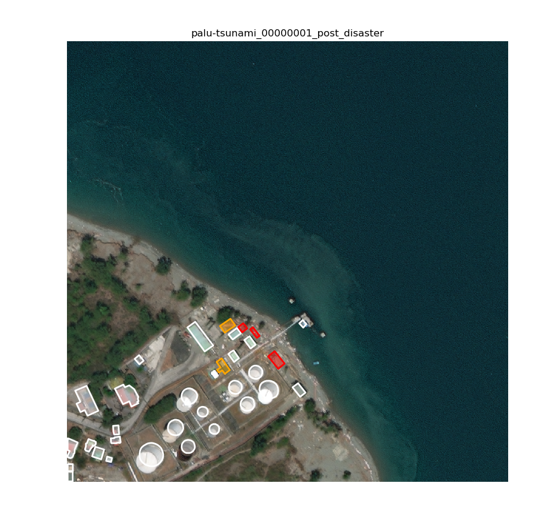
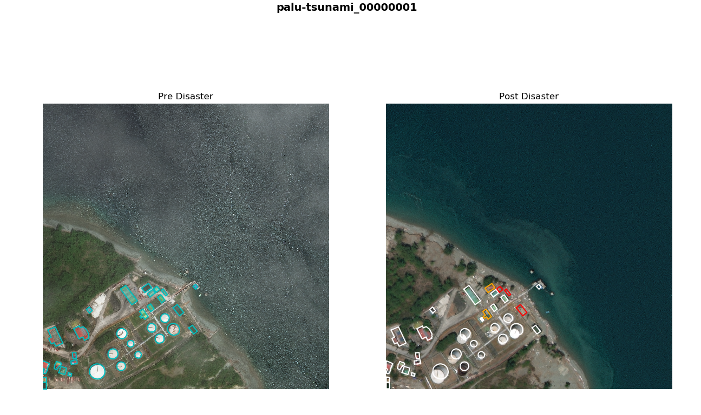

## xView2 Challenge Toolkit

Toolkit for the [xView2 Building Damage Assessment Challenge](https://xview2.org/).

### About the data
The training dataset in total contains 8399 pairs (Tier1: 2799, Tier3: 5600) of high-resolution RGB satellite imagery in PNG format. The datasets are organized into pairs of images. Each pair is a training instance: one image from before the natural disaster (e.g., socal-fire_00001390_pre_disaster.png), and another image from after a disaster occurred (e.g., socal-fire_00001390_post_disaster.png). Filenames in the training set indicate the location and type of disaster, a numerical ID for the pair of images, and whether the image is "pre" or "post" disaster event.

The training set also includes label information in the form of metadata and building annotations. Labels are provided in JSON format with filenames corresponding to each image in the set. Polygon annotations follow the WKT format.

A test dataset (2.6 GB, GZIP archive) is also provided for the purposes of competition; only input images are provided for the test set. The challenge is to localize buildings and score building damage on the test set! The 933 pairs of images in the test set were sampled from a similar distribution of disasters and instrumentation as the training dataset. Filenames in the test set have a numerical ID and indicate whether the image is "pre" or "post" disaster, but test filenames do not indicate the location or type of disaster. Further information regarding the dataset can be found in their papers [here](http://openaccess.thecvf.com/content_CVPRW_2019/papers/cv4gc/Gupta_Creating_xBD_A_Dataset_for_Assessing_Building_Damage_from_Satellite_CVPRW_2019_paper.pdf) and [here](https://arxiv.org/pdf/1911.09296.pdf)

### Features

The toolkit allows for the following:

#### 1. Visualise annotations

a. Single View

   

b. Comparitive View

   

#### 2. Converts annotations into MS-COCO annotations for instance segmentation.

#### 3. Converts annotations into segmentation maps for semantic segmentation.

|                            Pre                                             |                                               Post                                      		      |   
|----------------------------------------------------------------------------------|--------------------------------------------------------------------------------------------------|
|    |   |

### Todo

1. Add evaluator.
